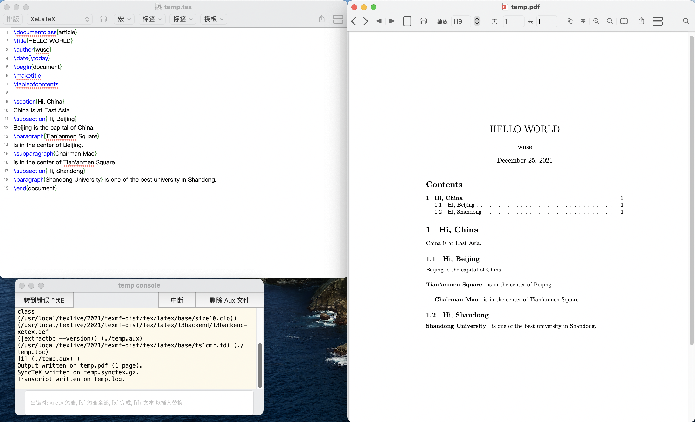
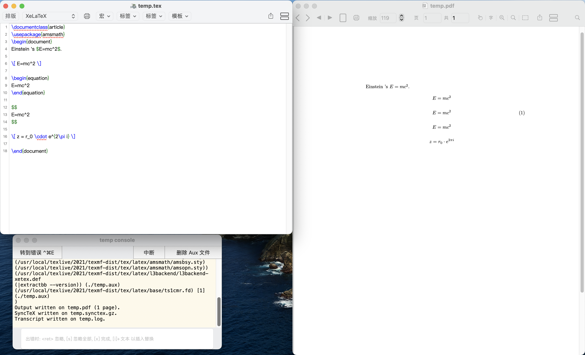
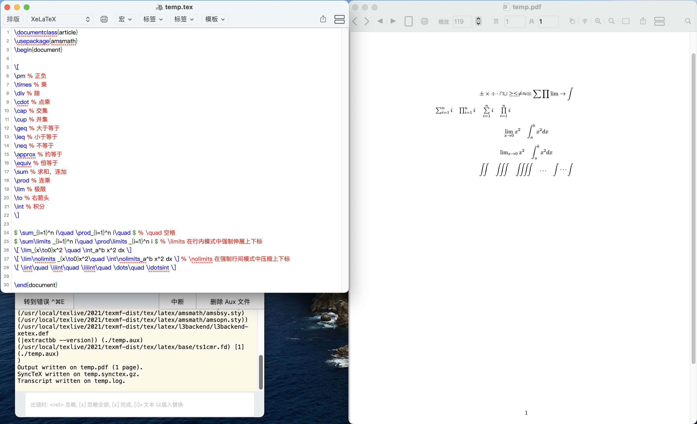
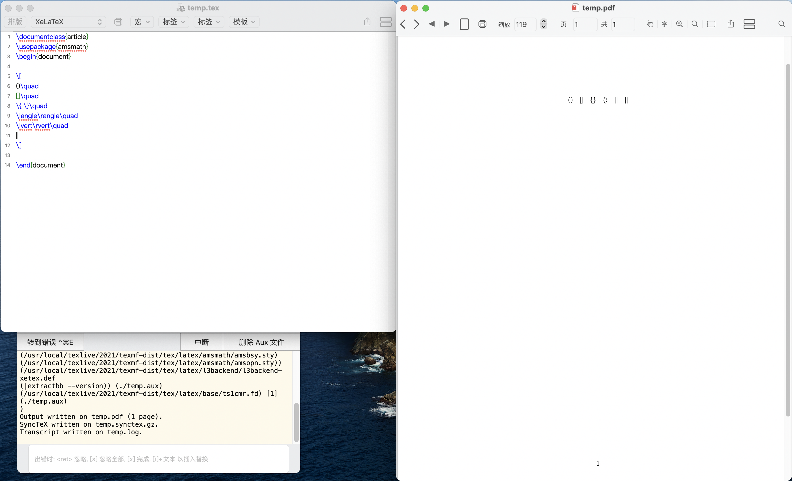
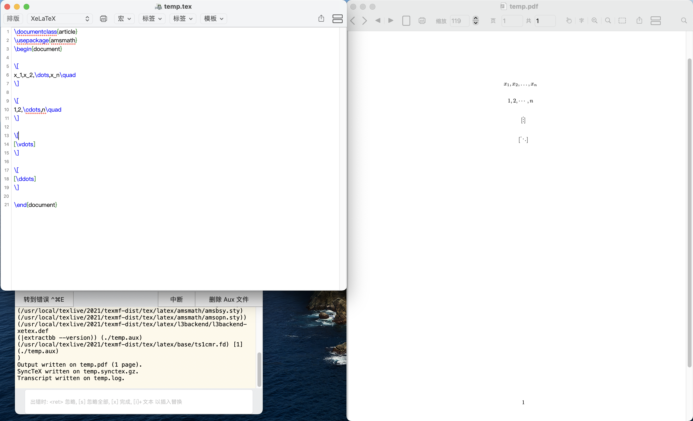
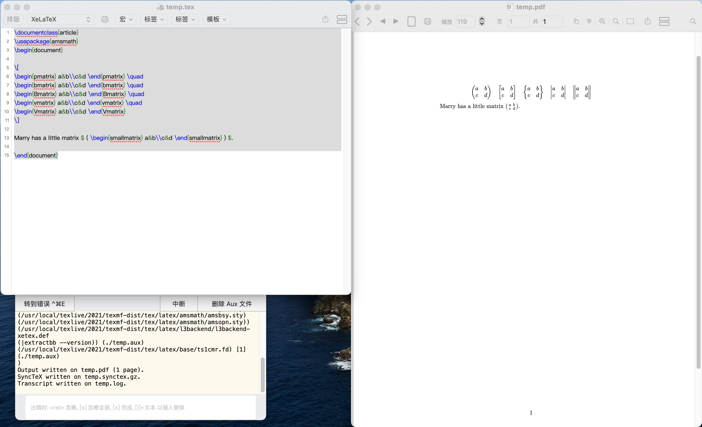
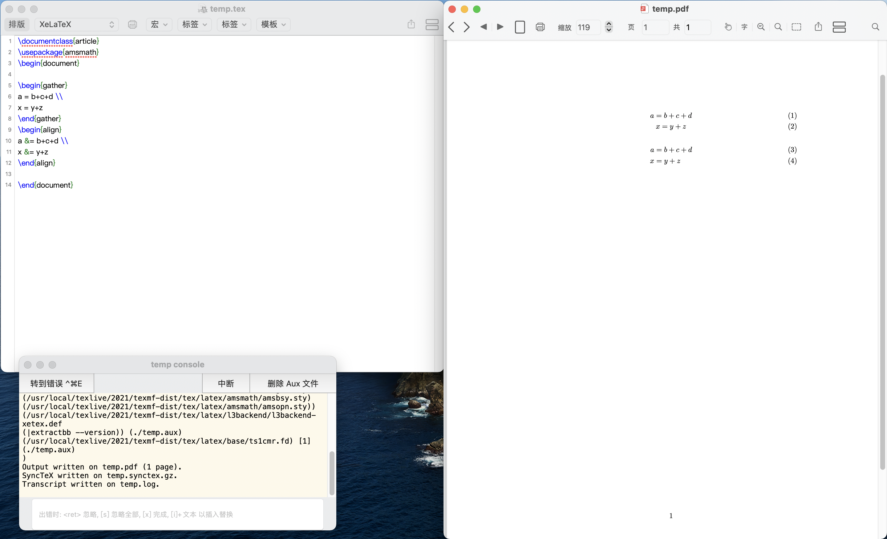
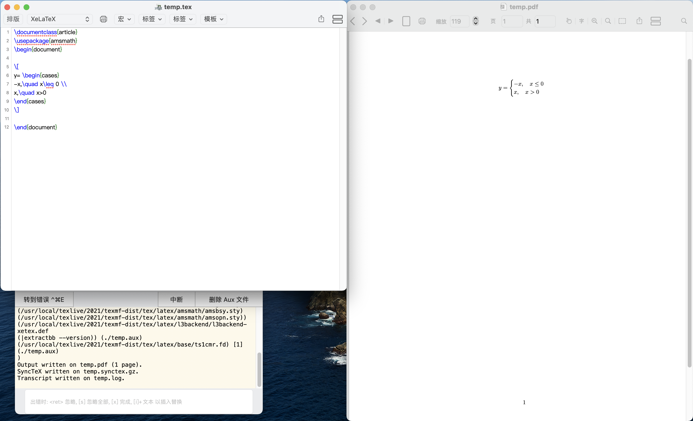
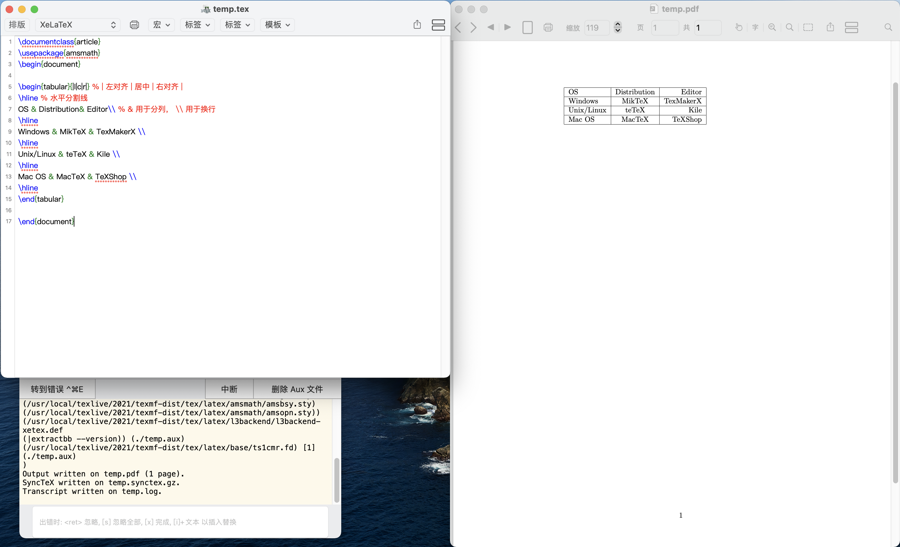
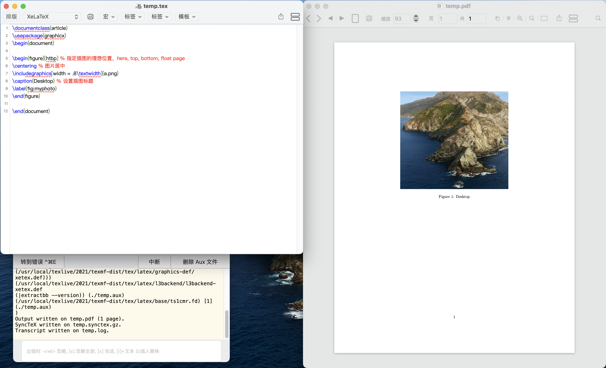

# 一份其实很短的 LaTeX 入门文档

> https://liam.page/2014/09/08/latex-introduction/#TeX-%E5%AE%B6%E6%97%8F

## TeX 家族

### TeX

TeX 是高德纳（Donald Ervin Knuth）教授做出来的**排版引擎**，同时也是该引擎使用的**标记语言**（Markup Language）的名称。

- **引擎**：是指能够实现断行、分页等操作的程序。
- **标记语言**：是指一种将控制命令和文本结合起来的格式，它的主体是其中的文本而控制命令则实现一些特殊效果。

### LaTeX

而 LaTeX 则是 L. Lamport 教授开发的基于 TeX 的排版系统。实际上 LaTeX 利用 TeX 的控制命令，定义了许多新的控制命令并封装成一个**可执行文件**。这个可执行文件会去解释 LaTeX 新定义的命令成为 TeX 的控制命令，并最终交由 TeX 引擎进行排版。

### pdfTeX - pdfLaTeX

- TeX 系统生成的文件是 dvi 格式，pdfTeX 是对 TeX 引擎的扩展，pdfTeX 直接输出 pdf 格式的文档。
- pdfLaTeX 这个程序的主要工作依旧是将 LaTeX 格式的文档进行解释，不过此次是将解释之后的结果交付给 pdfTeX 引擎处理。

### XeTeX - XeLaTeX

XeTeX 引擎直接支持 Unicode 字符。使用 XeTeX 引擎需要使用 UTF-8 编码。

### CTeX - MiKTeX - TeX Live

CTeX, MiKTeX, TeX Live 都是被称为**发行**的软件合集。他们包括了上述各种引擎的可执行程序，以及一些文档类、模板、字体文件、辅助程序等等。其中 CTeX 是建立在 MiKTeX 的基础之上的。

## 编辑器

TeX 的源代码是后缀为 `.tex` 的**纯文本文件**，可以用任何文本编辑器打开。而最流行的两个 TeX 发行（TeX Live 和 MiKTeX）都带有 TeXworks **编辑器**。

所谓 TeX 发行，也叫 TeX 套装，指的是包括 TeX 系统的各种可执行程序，以及他们执行时需要的一些辅助程序和宏包文档的**集合**。可以在 TeX Live 中下载 MacTex，而默认的编辑器伟 TeXShop。

## 排版工具

TeXworks 为我们预设了若干排版工具（pdfTeX, pdfLaTeX, XeTeX, XeLaTeX 等），默认为 pdfTeX，本文主要用到其中的 **XeLaTeX**。

## 第一篇文档

```latex
\documentclass{article}
% 这里是导言区
\begin{document}
Hello, world!
\end{document}
```

- **标记/命令**：

  是以反斜杠 `\` 开头的是**标记**（或者称为命令或控制序列），以第一个空格或非字母字符结束。它们不被输出，但是会影响输出文档的效果。一般形式为 `\command[options]{args}`。

- **文档类**：

  `documentclass` 为**文档类**，不同的文档类输出的效果不同，这里调用的是 `article`。

- **注释**：

  `%` 为**注释**。

- **环境**：

  `begin` 和 `end` 以及它们中间的内容被称为**环境**，只有在 `document` 环境中的内容才会被输出。

- **导言区**：

  `\documentclass{article}` 和 `\begin{document}` 中间为**导言区**，导言区设置页面大小、页眉页脚样式、章节标题样式等等。

## 组织你的文章



### 标题、作者、日期

```latex
\documentclass{article}
\title{HELLO WORLD}
\author{wuse}
\date{\today}
\begin{document}
\maketitle
Hello，world!
\end{document}
```

`\maketitle` 将导言区中的标题、作者、日期都渲染出来了

### 章节和段落

```latex
\documentclass{article}
\title{HELLO WORLD}
\author{wuse}
\date{\today}
\begin{document}
\maketitle
\section{Hi, China}
China is at East Asia.
\subsection{Hi, Beijing}
Beijing is the capital of China.
\paragraph{Tian'anmen Square}
is in the center of Beijing.
\subparagraph{Chairman Mao}
is in the center of Tian'anmen Square.
\subsection{Hi, Shandong}
\paragraph{Shandong University} is one of the best university in Shandong.
\end{document} 
```

在 `article` 中定义了 5 个命令来调整文章的组织：

- `\section{·}`
- `\subsection{·}`
- `\subsubsection{·}`
- `\paragraph{·}`
- `\subparagraph{·}`

### 目录

`\tableofcontents` 用于生成目录

## 插入数学公式

为了使用 AMS-LaTeX 提供的数学功能，我们需要在导言区加载 `amsmath` 宏包：

```
\usepackage{amsmath}
```

### 数学公式模式

LaTeX 的数学模式有两种：行内模式 (inline) 和行间模式 (display)。

- 在行文中，使用 `$ ... $` 可以插入行内公式

- 使用 `\[ ... \]` 可以插入行间公式，也有 plainTeX 风格的 `$$ ... $$` 来插入不编号的行间公式，但是在 LaTeX 中这样做会改变行文的默认行间距。

- 如果需要对行间公式进行编号，则可以使用 `equation` 环境：

  ```latex
  \begin{equation}
  ...
  \end{equation}
  ```

### 上下标

```latex
\documentclass{article}
\usepackage{amsmath}
\begin{document}
Einstein 's $E=mc^2$.

\[ E=mc^2 \]

\begin{equation}
E=mc^2
\end{equation}

$$
E=mc^2
$$

\[ z = r_0 \cdot e^{2\pi i} \]

\end{document}
```

- `^` 上标
- `_` 下标
- `{}` 将括号内的字符看作整体



### 根式与分式

- `\sqrt{·}`
- `\frac{·}{·}`

### 运算符

某些小的运算符可以直接输入，但某些需要命令来生成

```latex
\documentclass{article}
\usepackage{amsmath}
\begin{document}

\[
\pm % 正负
\times % 乘
\div % 除
\cdot % 点乘
\cap % 交集
\cup % 并集
\geq % 大于等于
\leq % 小于等于
\neq % 不等于
\approx % 约等于
\equiv % 恒等于
\sum % 求和，连加
\prod % 连乘
\lim % 极限
\to % 右箭头
\int % 积分
\]

$ \sum_{i=1}^n i\quad \prod_{i=1}^n i\quad $ % \quad 空格
$ \sum\limits _{i=1}^n i\quad \prod\limits _{i=1}^n i $ % \limits 在行内模式中强制伸展上下标
\[ \lim_{x\to0}x^2 \quad \int_a^b x^2 dx \]
\[ \lim\nolimits _{x\to0}x^2\quad \int\nolimits_a^b x^2 dx \] % \nolimits 在强制行间模式中压缩上下标
\[ \iint\quad \iiint\quad \iiiint\quad \dots\quad \idotsint \]

\end{document}
```



### 括号

```latex
\documentclass{article}
\usepackage{amsmath}
\begin{document}

\[
()\quad
[]\quad
\{ \}\quad
\langle\rangle\quad
\lvert\rvert\quad
||
\]

\end{document}
```



### 省略号

```latex
\documentclass{article}
\usepackage{amsmath}
\begin{document}

\[
x_1,x_2,\dots,x_n\quad
\]

\[
1,2,\cdots,n\quad
\]

\[
[\vdots]
\]

\[
[\ddots]
\]

\end{document}
```



### 矩阵

```latex
\documentclass{article}
\usepackage{amsmath}
\begin{document}

\[
\begin{pmatrix} a&b\\c&d \end{pmatrix} \quad
\begin{bmatrix} a&b\\c&d \end{bmatrix} \quad
\begin{Bmatrix} a&b\\c&d \end{Bmatrix} \quad
\begin{vmatrix} a&b\\c&d \end{vmatrix} \quad
\begin{Vmatrix} a&b\\c&d \end{Vmatrix}
\]

Marry has a little matrix $ ( \begin{smallmatrix} a&b\\c&d \end{smallmatrix} ) $.

\end{document}
```



### 多行公式

#### 长公式

```latex
\documentclass{article}
\usepackage{amsmath}
\begin{document}

\begin{multline}
x = a+b+c+{} \\
d+e+f+g
\end{multline}

\[
\begin{aligned}
x ={}& a+b+c+{} \\
&d+e+f+g
\end{aligned}
\]

\end{document}
```


#### 公式组

```latex
\documentclass{article}
\usepackage{amsmath}
\begin{document}

\begin{gather}
a = b+c+d \\
x = y+z
\end{gather}
\begin{align}
a &= b+c+d \\
x &= y+z
\end{align}

\end{document}
```



#### 分段函数

```latex
\documentclass{article}
\usepackage{amsmath}
\begin{document}

\[
y= \begin{cases}
-x,\quad x\leq 0 \\
x,\quad x>0
\end{cases}
\]

\end{document}
```



## 插入图片和表格

### 图片

```latex
\documentclass{article}
\usepackage{graphicx}
\begin{document}
\includegraphics{a.jpg}
\includegraphics[width = .8\textwidth]{a.jpg}
\end{document}
```

### 表格

```latex
\documentclass{article}
\usepackage{amsmath}
\begin{document}

\begin{tabular}{|l|c|r|} % | 左对齐 | 居中 | 右对齐 |
\hline % 水平分割线
OS & Distribution& Editor\\ % & 用于分列， \\ 用于换行
\hline
Windows & MikTeX & TexMakerX \\
\hline
Unix/Linux & teTeX & Kile \\
\hline
Mac OS & MacTeX & TeXShop \\
\hline
\end{tabular}

\end{document}
```



### 浮动体

```latex
\documentclass{article}
\usepackage{graphicx}
\begin{document}

\begin{figure}[htbp] % 指定插图的理想位置，here, top, bottom, float page
\centering % 图片居中
\includegraphics[width = .8\textwidth]{a.png}
\caption{Desktop} % 设置插图标题
\label{fig:myphoto}
\end{figure}

\end{document}
```

